# Good Uncle App Clone

This is an implementation of some basic features found in the Good Uncle App built in React Native. As a user, you can sign up for a new account, sign into your existing account, look through the menu, and add items into your cart.

## Table of Contents

- [Suggestions for App](#Suggestions-for-App)
- [Installation](#installation)
- [Project Requirements & How They Are Implemented](#project-requirements-&-how-they-are-implemented)
- [Basic Features and Functionality](#basic-features-and-functionality)
- [Troubleshooting](#Troubleshooting)
- [Areas for Improvement](#Areas-for-Improvement)

## Suggestions for App

### Below are some of my ideas of how the Good Uncle team could improve their app. These are mostly based on my experience signing up and navigating the app, as I have not yet ordered something from the app.

- Kitchen Hours
  - Some locations didn't have hours listed. All hours are just shown as "CLOSED". Is there a better message that can be shown here?
  - Have a statement under "Kitchen is closed" that lets the user know when the next time the Kitchen will be open.
    - Edit: Noticed "WE'LL OPEN FOR DELIVERY SOON" subheading. But still think a more descriptive message would be beneficial.
  - Or if the kitchen is currently open, when the kitchen will close that day.
  - Update kitchen hours more regularly. At 1:30 PM kitchen was still closed despite nominal 12 PM opening.
    

      
<strong>See Screenshot from Hours screen</strong>

       
      

      
      

      

- Make entering credit card data easier
  - Integrate Google Pay/Apple Pay
    - [React Native Payments library](https://github.com/naoufal/react-native-payments "React Native Payments Library") seems like the way to go for Google & Apple Pay integration
  - Allow custom naming of credit cards in the case where user has different cards of the same brand.
- `Picker` components don't inherit app font and my custom system font is used.
    

    
<strong>See Screenshot from Location Picker</strong>

     
    

    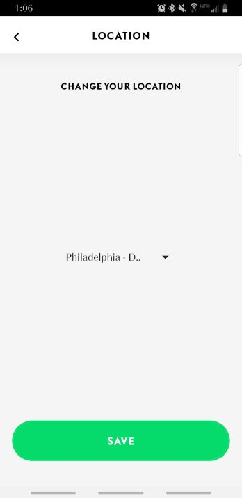
    

    
Note how "Philadelphia - Drexel" (which doesn't display fully) is in a different font.  This is typical of the grad year, birthday, and gender Pickers.

  

    - RN docs for [Limited Text Style Inheritance](https://facebook.github.io/react-native/docs/text#limited-style-inheritance "RN Docs Text Component") suggest making a component e.g. `MyAppText` that would replace `Text` components so that this can be globally styled. I'm unsure if this would be easier than just making sure all text components have font styling.
    - Also noticed this on the "Browse Items" and "Support" tabs.
- Allow users to favorite an item for quick ordering in the future.
- Allow users to schedule a time in advance for pick up.
- After having the app open for some time, an activity indicator replaces screen content. Can this data pull be done in the background?
- Clicking outside of modal windows should close the modal.
- Button to close menu item detail screen should be a little more prominent. Drop shadow isn't enough to differentiate it from the menu background in some views.
  

      
<strong>See Screenshots with highlighted close button</strong>

       
      

      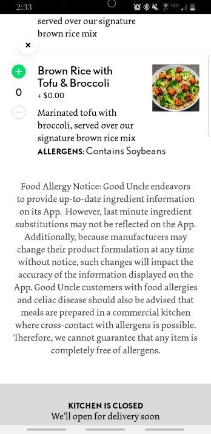
      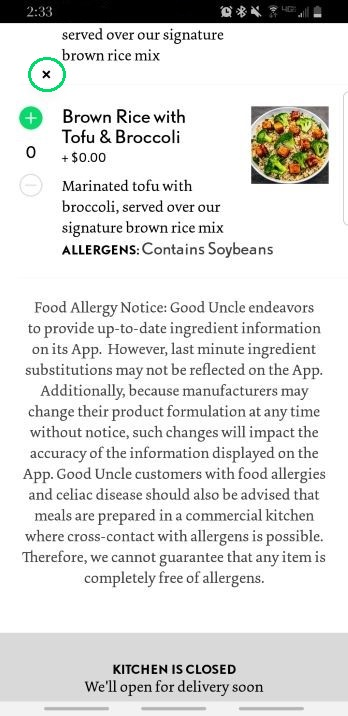
      

    

## Installation

#### On your mobile device (if not using simulator):

- Download Expo Client App
  - [Android](https://play.google.com/store/apps/details?id=host.exp.exponent&referrer=www "Google Play Store")
  - [iOS](https://itunes.apple.com/app/apple-store/id982107779 "App Store")

#### On your computer:

- [Install Node.js](https://nodejs.org/en/ "Node.js download")
- Download the Expo CLI `yarn global add expo-cli`
- Clone this repo `git clone https://github.com/PeterArriaza/GoodUncle.git`
- Install dependencies with `yarn install`
- Move into the project folder `cd GoodUncle/`
- Start the development server and client `expo start`
- Ensure that mobile device is on same wireless network as computer and Open Expo Client on your mobile device. Scan the QR code printed by `expo start` with Expo Client (Android) or Camera (iOS). You may have to wait a minute while your project bundles and loads for the first time.

#### If using emulator/simulator (Android Studio/Xcode):

- Open respective emulator/simulator program and launch virtual device
- Run `expo start`
- If it does not open automatically, navigate to [http://localhost:19002] in your browser
- Click "Run on Android device/emulator" or "Run on iOS simulator"

## Project Requirements & How They Are Implemented

- The app should be built as a native mobile app (i.e., _not_ a mobile web app) using React Native and written in JavaScript (not TypeScript or another language that cross-compiles into JS).

  - This project is written with React Native with React Native Navigation and Redux using ES6 syntax.

- The app should build on both iOS and Android — running in the iOS simulator / Android emulator is fine.

  - Expo CLI allows builds on both iOS and Android. This project can easily be "ejected" to allow for builds through the React Native CLI.

- You do not need to write tests for your app. But, if test writing is something that helps your development process, by all means write tests — we would love to see them and you should include any tests in the project repo.

  - No tests were written and all user features were manually tested on a physical device.

- A core part of this assignment is for you to consider how to structure data flows across multiple views. Although this is a simple app, you should set up the skeleton of the app in a way that would scale for a much larger app.

  - Redux is used for state management and holds the items in the user's cart and total of the cart.
  - Local state is used for displaying the menu and user sign up/sign in as these state variables do not need to be accessed in other screens.

- You should set up a GitHub repo to hold your project.

  - https://github.com/PeterArriaza/gooduncle

- The project repo should include a clear readme that explains to anyone who clones down the project how to build and run it in Xcode and Android Studio, as well as how to troubleshoot common problems.

  - You're looking at it!

- Don’t worry about the styling of your app. But, please make sure all content is visible and that the app works on an iPhone 8, iPhone 11 Pro Max, Pixel 2, and Pixel 2 XL. If you do find yourself motivated to style the app, feel free to do so.
  - Physical device testing on Samsung S9 and iPhone X. Emulated with Pixel 2.

## Basic Features and Functionality

- [System userflow diagram](https://www.figma.com/file/eHVTwF9HGnRUA7RfbrIQyd/GoodUncle?node-id=0%3A1 "System userflow diagram")

- The app should have a landing screen, from which the user can choose to sign up, or sign in — choosing either option brings the user to a new view.
  

  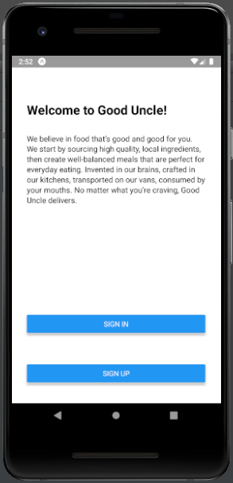
  

- On sign up, the user will be required to enter a 10-digit phone number and minimum 6-character password. A unique phone number may only be used once to sign up for an account. The user will be brought into the app experience once they sign up.

  - User authentication is handled by AWS Amplify and Amazon Cognito. These services were selected because of their simplicity in integration and ability to scale. They also remove the need to maintain server side code.
  - Errors on form such as non-unique phone number or invalid password format are shown with an Alert. AWS Amplify provides useful error messages to know exactly what the issue is.
    

      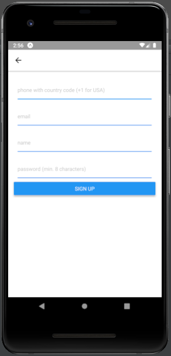
      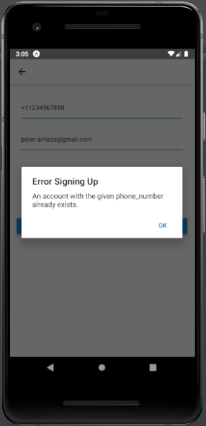
      

  - After successfully signing up for an account, users are emailed a confirmation via AWS Amplify which they need to enter in a new screen.
  - Submission of the correct verification code brings the user to the menu screen.
     

    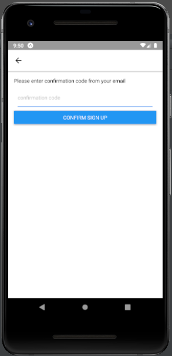
    

- On sign in, the user will be required to enter a phone number and valid password for an already existing account. The user will be brought into the app experience once they sign in.
  - The various form inputs bring up applicable keyboard layouts on sign in and sign up screens.
  - AWS Amplify verifies that the provided information is correct and an error will be shown if the user's credentials are incorrect.
    

      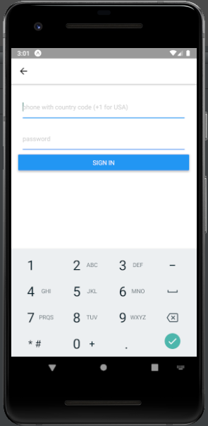
      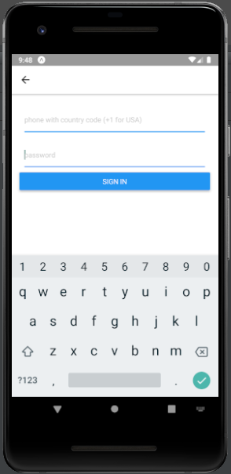
      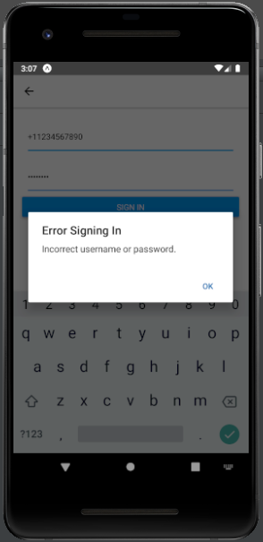
      

- A user should be able to log out, which brings them back to the landing screen.

  - See screenshot below. Log out button is only shown on Menu tab to show customization of screen headers in the stack navigator.

- Good Uncle sells 5 categories of products: mains (i.e., an entree), sides, snacks, drinks, and condiments. For this project, only products that are "mains" are displayed.

  

    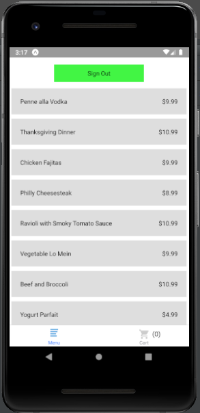
    

- Tapping a main opens a new view that shows the main’s name, description, and price. This view should have an "add to cart" button that adds the main to the user’s cart and returns the user to the previous view.

  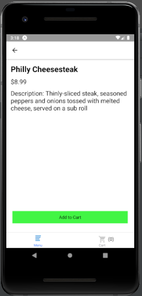
  

- The current, up to date subtotal of the user’s cart should be visible on all views once the user logs in.

  

    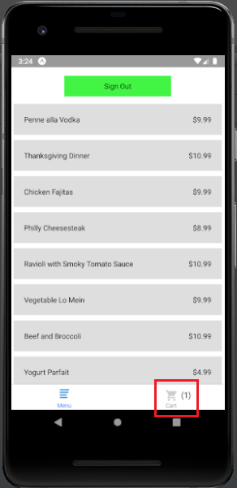
    

- From anywhere, the user can tap on their cart total, which opens a new view with a cart summary. From the cart summary a user can remove items from their cart, which updates their subtotal globally.
  - Individual item subtotals are shown in item rows.
  - Pressing either the "+" or "-" buttons updates the item quantity, subtotal, and cart total globally. These values are pulled from the Redux store.
    

      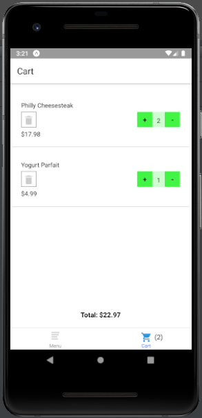
      

## Troubleshooting

- App does not load
  - Make sure that device is connected to same wireless network as server run from command line.
  - Try connecting device to computer with USB cable.
  - If using an emulator, you might need to switch the "Connection type" in the expo window to "Local"
- System requirements:
  - Android Lollipop (5.0)
  - iOS 10.0

## Areas for Improvement

- Loading menu items asynchronously. Depending on internet speed or menu length, I have noticed that menu items are not displayed in the menu tab for up to a second.
  - Per React Native Docs, using the [`getItemLayout`](https://facebook.github.io/react-native/docs/flatlist.html#getitemlayout "Get Item Layout Prop") prop in the FlatList may help improve performance in rendering.
  - Performance may also improve using a production build rather than the development build.
- User authorization persistence. Once app is closed, user is required to sign back into app. This would be accomplished by storing token in AsyncStorage as described in the [React Navigation docs](https://reactnavigation.org/docs/en/auth-flow.html "React Navigation - Auth Flow")
- User password recovery. Methods are provided for this with AWS Amplify, but for simplicity this feature was omitted.
- Form validation. [Redux Form](https://redux-form.com/8.2.2/ "Redux Form website") provides elegant error handling and other features but was not included in this project.
- Floating point math. Item and cart subtotals are shown with the `JSON.parse(...).toFixed(2)` method. Displayed numbers are sometimes shown without the specified precision.
- [Accessibility](https://facebook.github.io/react-native/docs/accessibility "React Native Accessibility Docs"). `accessibility`, `accessibilityLabel`, `accessibilityHint`, and `accessibilityRole` were not specified for any elements. I am overall unfamiliar with how to test for accessibility on mobile.
